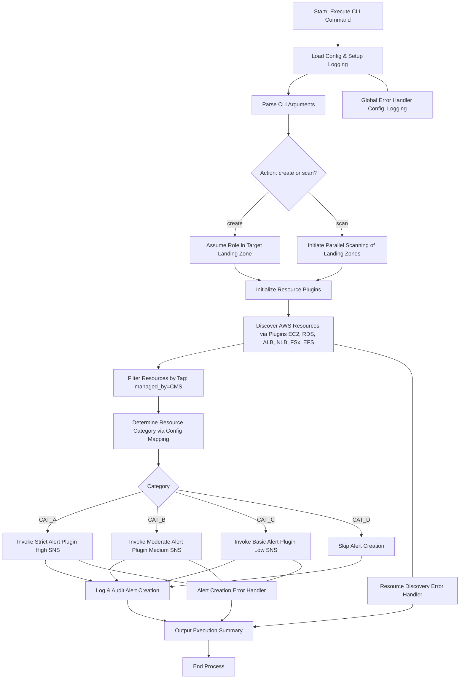
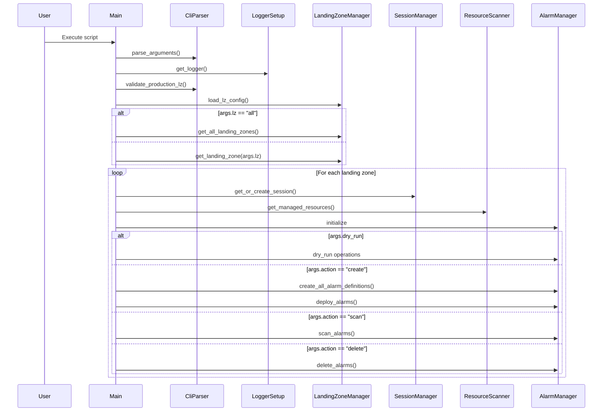
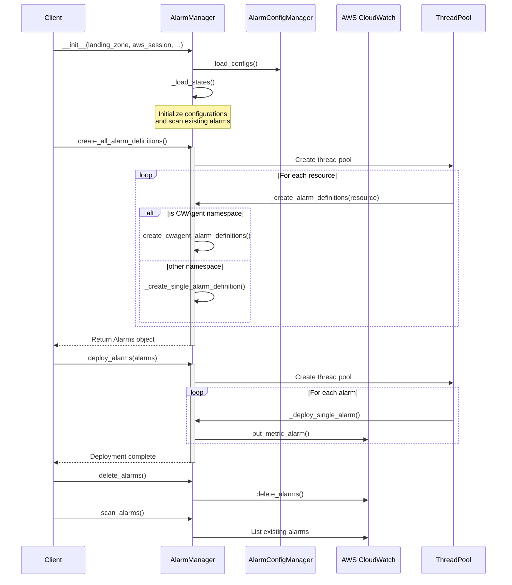
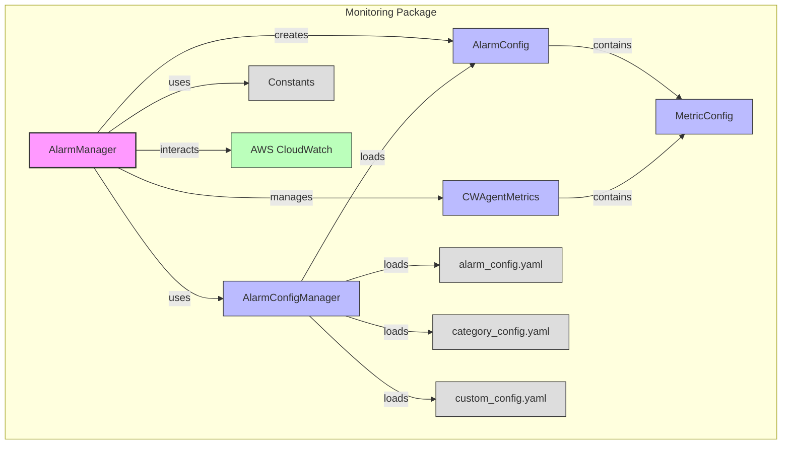
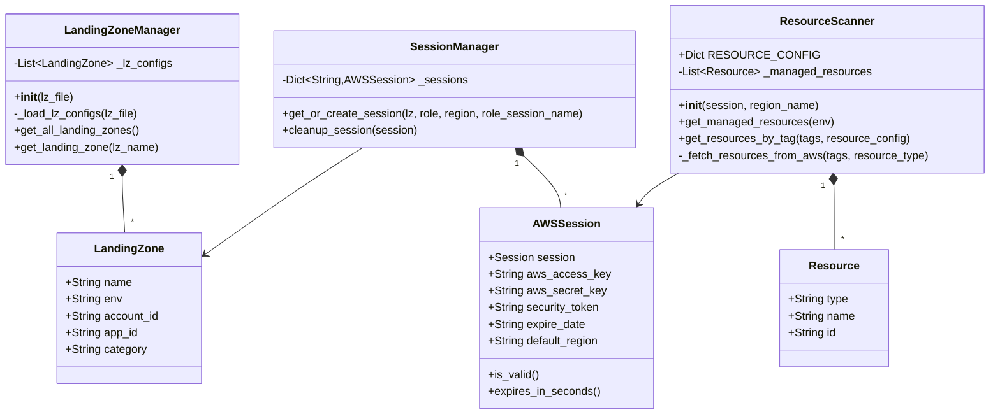

# Architecture Overview

## Purpose

Develop a scalable, maintainable, and extensible Python CLI tool that automates the creation, deletion, and scanning of AWS CloudWatch alerts across multiple AWS accounts based on resource categories and predefined thresholds.

## Key Requirements

- **Language:** Python 3.10 or higher
- **AWS SDK:** Boto3
- **Execution Environment:** Engineer's laptops or CMS jump boxes with access to AWS APIs
- **Deployment:** Source code repository (GitHub)
- **Logging:** Audit logs stored securely in an S3 bucket
- **Scalability:** Capable of handling 200+ AWS accounts
- **Extensibility:** Easy to add new resource types and functionalities in the future

## High-Level Design



### Core Components

1. **Main Application (`main.py`):**

   - Entry point that initializes the application
   - Parses command-line arguments
   - Orchestrates the workflow based on user inputs
   - Handles error management and graceful shutdowns

2. **CLI Parser (`cli_parser.py`):**

   - Handles all command-line interactions
   - Validates inputs and argument combinations
   - Provides help messages and usage examples
   - Supports subcommands for different operations

3. **AWS Connection Manager (`aws_manager/core/session.py`):**

   - Manages AWS sessions and credentials
   - Handles role assumptions across accounts
   - Implements connection pooling and reuse
   - Provides retry logic for AWS API calls

4. **Resource Manager (`aws_manager/core/resources.py`):**

   - Discovers resources across AWS accounts
   - Filters resources based on tags and categories
   - Implements caching for resource lookups
   - Supports pagination for large resource sets

5. **Alarm Manager (`aws_manager/monitoring/alarm_manager.py`):**

   - Creates and deletes CloudWatch alarms
   - Manages alarm configurations and thresholds
   - Performs alarm health checks and validation
   - Supports bulk operations for efficiency

6. **Configuration Manager (`aws_manager/monitoring/alarm_config_manager.py`):**

   - Loads and validates YAML configurations
   - Handles landing zone configurations (`configs/landing_zone_configs.yml`)
   - Manages alarm settings (`configs/alarm_settings.yml`)
   - Manages category configurations (`configs/category_configs.yml`)
   - Manages default and custom settings (`configs/custom_settings.yml`)

7. **Logger (`logger.py`):**

   - Implements structured logging
   - Handles local and S3 log storage
   - Provides audit trail capabilities
   - Supports different log levels and formats

8. **Utilities (`utils.py`):**
   - Common helper functions
   - Reusable AWS utility functions
   - Date/time handling utilities
   - Input/output formatting helpers

### Codebase Structure

```plaintext
.
├── README.md
├── aws_manager
│   ├── __init__.py
│   ├── core
│   │   ├── __init__.py
│   │   ├── landing_zone.py
│   │   ├── resources.py
│   │   └── session.py
│   └── monitoring
│       ├── __init__.py
│       ├── alarm_config.py
│       ├── alarm_config_manager.py
│       ├── alarm_manager.py
│       ├── constants.py
│       └── metric_config.py
├── cli_parser.py
├── configs
│   ├── alarm_settings.yml
│   ├── category_configs.yml
│   ├── custom_settings.yml
│   └── landing_zone_configs.yml
├── constants.py
├── docs
│   ├── architecture.md
│   ├── projects.md
│   └── setup.md
├── logger.py
├── main.py
├── requirements.txt
├── tests
│   ├── __init__.py
│   ├── test_iam.py
│   └── test_landing_zone.py
└── utils.py
```

### Application Flow Sequence



### Alarm Manager Flow Sequence



### Alarm Manager

The Alarm Manager handles the creation and deployment of CloudWatch alarms across AWS accounts. Here's the components:

## Component Diagram



### Core Package


